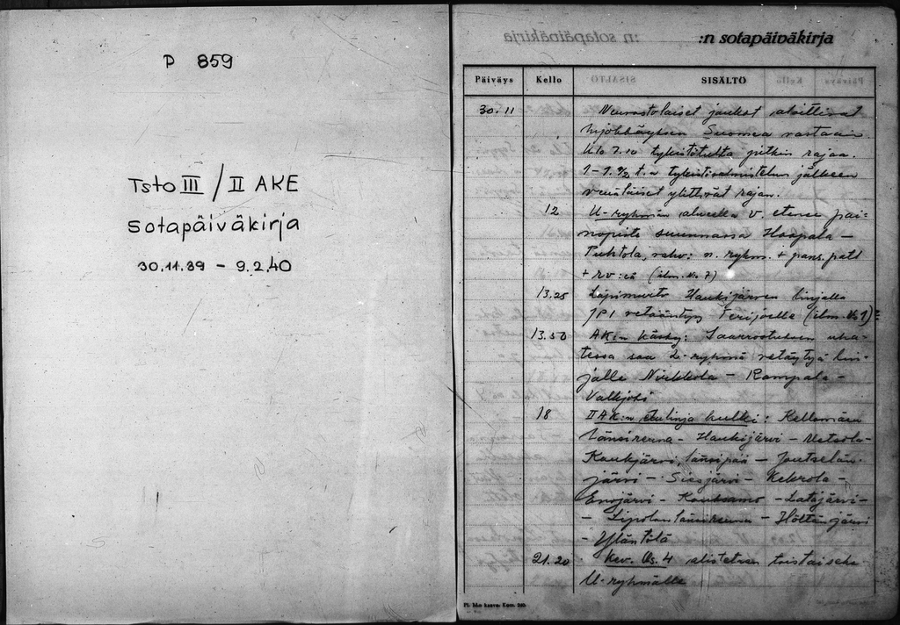
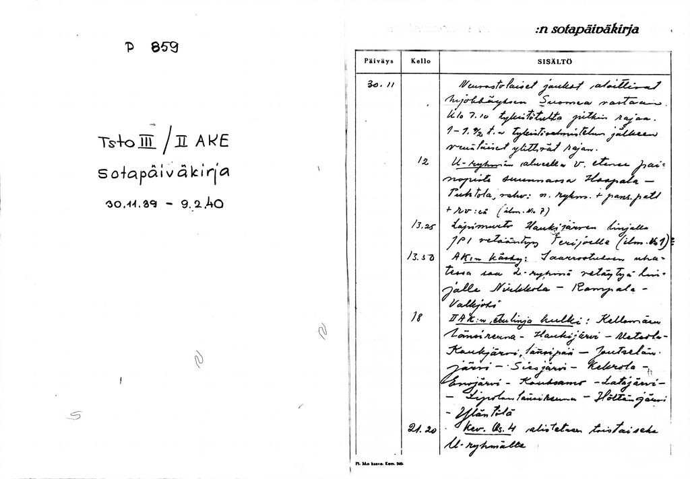

# Document binarization using deep learning

That is, turning this:



into this:



(The original image, and some of the images used to train the model, from the collection of the [Finnish national archive](https://arkisto.fi).)

## How to use with the pretrained model

Note that this will be a bit slow without a suitable GPU. On my Nvidia 1080 Ti, the prediction speed is about 0.7 Mpix/s (that is, a 7 Mpix image will take about 10 seconds to process). The prediction process does quite a bit of work to get high quality, like overlapping windows and predicting all the windows in different rotations; if speed is important to you, you might be able to get significant speedups for some quality loss by tuning that.

1. Install the required Python packages. Note that Python 3 is required.

```pip install -r requirements.txt```

Note that you will need to have whatever TensorFlow needs for GPU support (like CUDA etc.) to get the GPU speedup.

2. Put the images you want to run the script on in PNG format (named filename.png) in a directory, say, 'images'.

3. Run

```./apply_binarization.py images```

4. The output images are saved in a directory named `auto_bin` in the images directory, i.e. in this case `images/auto_bin`.


## How to train

1. Install the requirements as for using the pretrained model.

2. If you have your own training data, augment the data in [datasets/train](datasets/train) and [datasets/test](datasets/test) (and possibly edit the paths in the [prepare_data.sh](prepare_data.sh) script).

3. Prepare the training data. The datasets are included in the repository; this will extract random 224x224 windows for the training.

If you do not have GNU parallel installed (the `parallel` command), run it in serial:

```./prepare_data.sh```

This will take a while (the process is not particularly optimized; specifically, rotated windows are produced by rotating the original image, then extracting a window).

If you do have GNU parallel installed, this will be much faster as the work will be split on your processor cores:

```./prepare_data --print | parallel -bar```

4. Start a jupyterlab instance to run the training sheet:

``jupyter-lab``

5. In the browser window opened in the previous step, open [seg/binarization.py](seg/binarization.py) and execute the entire sheet. This should result in a model in the [model/](model/) directory.

6. Execute inference as in the previous section.
